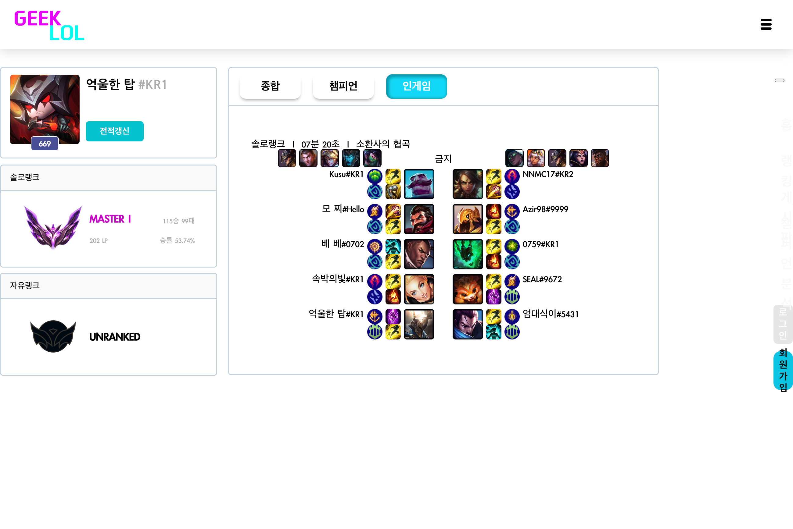

# KDT 팀 프로젝트 3조   - NOT (Noah's Ark or Titanic:노아의 방주 또는 타이타닉)
- 사이트 가기 : [GEEK LOL](http://geeklol.site)
- ppt 및 프로젝트 소개 : [canva 바로가기](https://www.canva.com/design/DAF83EX-8eY/HgqQhkd8n76Jt6HcLElocw/view?utm_content=DAF83EX-8eY&utm_campaign=designshare&utm_medium=link&utm_source=editor)
- 개발기간 : 2024-01-18~2024-02-18 (30일)

### 간단소개
- 롤 전적검색 & 커뮤니티 사이트입니다.
   - 회원가입을 하여 사이트를 이용해보세요!
   - riot API를 이용하여 유저의 정보를 검색, 상위 랭킹 목록을 조회할 수 있습니다.
   - 상대와의 충돌이 있을 때 해결이 안 된다면 사이트에 올려주세요! 트롤투표소를 통해 유저들의 생각을 들을 수 있습니다
   - 자랑하고싶거나 공유하고싶은 하이라이트 영상을 올리면 쇼츠처럼 다른사람에게 보여줄 수 있습니다.
   - 심심할 때, 반응속도와 미니게임을 할 수 있습니다.

## 🦁 팀원 소개 

  

|    fullStack   |   fullStack   |   FrontEnd   |   FrontEnd   |   backEnd   |   backEnd   |
|:--------------:|:----------------:|:----------------:|:----------------:|:----------------:|:----------------:|
|  |  || | | |
| [김용섭](https://github.com/yongseopK) | [임선진](https://github.com/Ajeabal) | [이효원](https://github.com/Ajeabal) | [유가령](https://github.com/YOOGARYUNG) | [박주호](https://github.com/JuHo99) | [송민건](https://github.com/smg0218) |

## 😎 페이지 소개

### 메인페이지
 - 유저 네임을 통해 전적을 검색 할 수 있음
 - 헤더를 통해 로그인을 할 수 있으며, 다른 기능들을 이용가능함

 

### 로그인 & 회원가입
 - 이메일 형식의 로그인
 - 비동기적 유효성 검사

 - 

### 유저 전적 조회 페이지 
 - Riot API를 사용한 전적 조회
 - 유저의 기본정보, 랭크 정보, 플레이 기록 등 조회 가능

### LOL 게임 내 랭킹 목록

### 트롤 재판(투표) 게시판
 - 억울한 부분이나 판단이 어려운 플레이를 올리고  여러 유저들의 의견을 받을 수 있음
 - 3일마다 좋아수가 가장 많은 투표글을 가져와 대표 게시물로 등록하고   찬성,반대를 투표할 수 있게함

### 하이라이트(쇼츠) 게시판
 - 짧은 영상을 올리고 다른 유저들이 시청할 수 있음 

### 미니게임 2종 - 반응 속도 테스트
 - 화면이 바뀌는 것을 보고 반응하는 속도를 체크

### 미니게임 2종 - 막타 치기 게임
- 빨간 미니언을 마지막으로 공격해서 없애면 +점수
- 제한시간 1분 30초로 시간 내로 많은 점수를 가진 유저가 1위.

